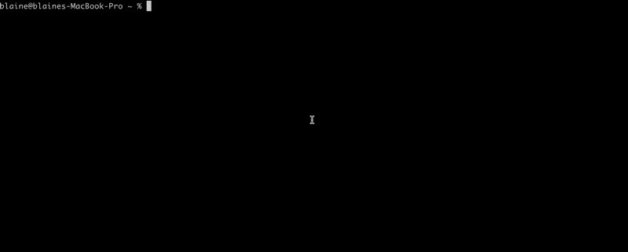

# superchain-registry-cli

<p align="center">
    
</p>

A command line tool that wraps Optimisms [superchain-registry](https://github.com/ethereum-optimism/superchain-registry) repository.

## Introduction

The `superchain-registry-cli` is designed to simplify interactions with the superchain-registry, providing a user-friendly command line interface for developers and operators.

## Prerequisites

- Ensure you have [Go](https://formulae.brew.sh/formula/go) installed on your system.

## Installation

- Install `superchain-registry-cli`:
    - `go install github.com/blmalone/superchain-registry-cli/sure@latest`
 
## Usage

After installation, run `sure --help` for a full breakdown of the available functionality.

## Examples

- List all chains in the superchain (default is mainnet): 
    ```bash 
        sure ls
        sure list
        sure ls --testnet
    ``` 
- Get all addresses for a chain: 
    ```bash 
        sure get-addresses --chain op --verbose
        sure ga -c op -v
        sure ga -c op -t -v
    ```
- Get a specific address by name (fuzzy match on `--address-name`): 
    ```bash
        sure ga -c zora --address-name l1 -v # all addresses containing "l1" - not case sensitive
        sure ga -c zora -an L1CrossDomainMessengerProxy -v
    ```

- Get all addresses for a given name across the superchain (fuzzy match on `--address-name`): 
    ```bash
        sure ga -an L1StandardBridge -v
    ```

- Usage with [cast](https://book.getfoundry.sh/cast/):
    ```bash
        cast call $(sure ga -c op -an L1StandardBridge) "version()(string)"
    ```
      

## Contributing

Contributions are welcome! Fork this repository and submit a pull request.

## License

This project is licensed under the MIT License - see the [LICENSE](LICENSE) file for details.
